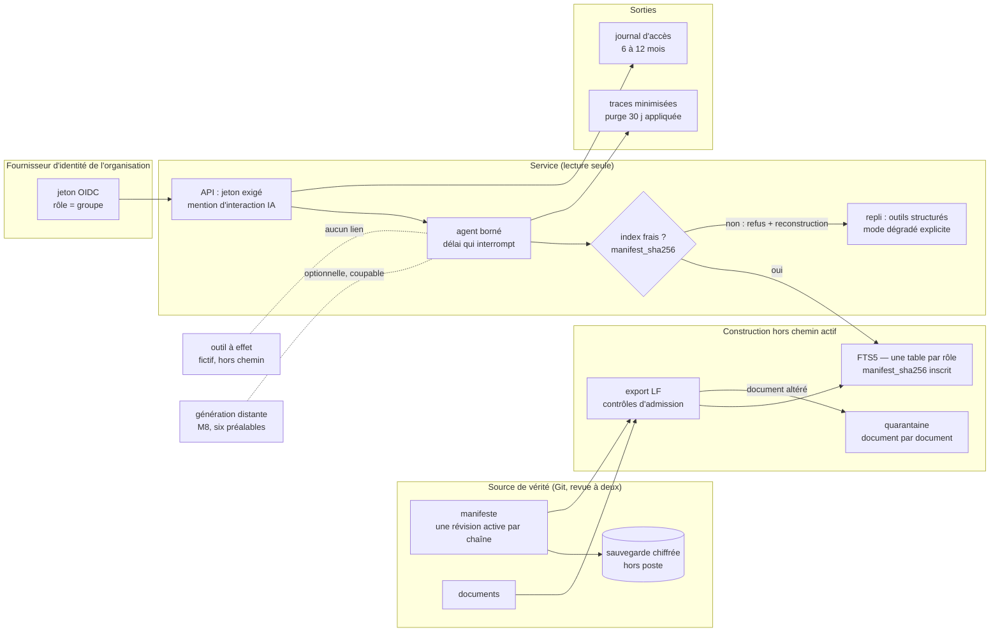

# Architecture cible — proposition à défendre

Statut : **non approuvée**. Aucun résultat de banc ne vaut approbation. La cible
attend la migration exercée du brief 2, la revue indépendante et une décision
humaine.

## Besoin et contraintes

| Axe | Contrainte |
|---|---|
| Public | techniciens, superviseurs, auditeurs ; `public` pour le seul contrat de réponse |
| Capacité | 7 documents aujourd'hui ; croissance inconnue ; hypothèse de 22 000 questions par mois pour les ordres de grandeur |
| Localisation | tout local ; seule la sauvegarde chiffrée sort du poste |
| Droits | appliqués avant le classement **et** avant le calcul de ses statistiques |
| Coût | aucune dépendance payante ; le coût dominant est l'exploitation, pas l'infrastructure |
| Ressources | poste ou serveur interne sans GPU |
| Compétences | Python, SQLite, Git : celles de l'équipe |
| Disponibilité | RTO 15 min pour l'index, 4 h pour la source (`resilience/recovery.md`) ; un repli papier existe toujours |

## Diagramme cible

## Différences avec l'existant

| # | Différence | Constat | Preuve | ADR |
|---|---|---|---|---|
| 1 | FTS5, une table par rôle, au lieu du lexical JSON | coût linéaire : 297 ms par requête à 7 000 documents ; statistiques qui traversent les droits dans un index partagé | `results/capacite-r1`, `results/portabilite-fts5-r1` | 0001 |
| 2 | rôle issu d'un jeton authentifié | rôle déclaré dans `policy.yaml` | RT-05, action simulée | 0002 |
| 3 | index lié à l'empreinte du manifeste, index périmé refusé | révocation non appliquée, index périmé servi | RES-07, RES-03 | 0003 |
| 4 | une seule révision active, revue à deux | deux révisions servies ; révision empoisonnée acceptée | RES-03, RT-03 | 0003 |
| 5 | quarantaine par document | un document altéré coupe tout le corpus | RES-06 | 0004 |
| 6 | délai qui interrompt l'outil | timeout constaté après coup | RES-05, RES-04 | 0005 (préalable 2) |
| 7 | purge des traces appliquée ; journal d'accès créé | purge absente ; aucun journal d'accès | RT-07, veille D3 | 0007 |
| 8 | mention d'interaction IA | absente depuis le 02/08/2026 | veille D8 | 0008 |
| 9 | sauvegarde chiffrée du manifeste | aucune copie hors poste | recovery.md | — (R-13) |
| 10 | outil à effet : fictif, hors chemin | inchangé | exercice sur table | 0006 |
| 11 | génération : absente, cible hybride conditionnelle | inchangé | alternatives.md | 0005 |

Ce que la cible ne change **pas** : le planificateur à une étape (SCN-006), le
refus des intentions d'écriture (SCN-013, ADV-001), l'exposition des conflits
(ADV-006) et le seuil de pertinence (RT-06). Ce sont des défauts de l'agent,
pas de l'architecture. Ils restent des risques transmis à M8 (R-04 à R-07).

## Gates avant migration

| Gate | Seuil | Mesuré par |
|---|---|---|
| Zéro fuite de droits | 0 renvoi sur les 11 sondes × 2 rôles, avant et après migration, et après rollback | brief 2, `scripts/portability_fts5.py` |
| Statistiques isolées | scores d'un rôle identiques avec ou sans un document qu'il ne voit pas | idem |
| Métadonnées et provenance conservées | révision, rôles, licence, checksum identiques champ par champ entre l'export et l'index | brief 2 |
| Révocation appliquée | l'index périmé est refusé ; après reconstruction, le document n'est plus renvoyé | cas gelé du brief 2 |
| Révision unique | deux révisions actives : export refusé | cas gelé du brief 2 |
| Écart de qualité mesuré | seuil fixé **avant** l'essai, sur des cas gelés distincts de la calibration | `migration_exercise/contract.md` |
| Retour arrière rejoué | index antérieur restauré par empreinte, **sauf** s'il rétablirait un droit révoqué | brief 2 |
| Aucun risque bloquant non traité | R-11 et R-12 fermés par la migration ; R-01, R-02, R-13 bloquent la **mise en service**, pas la migration | `security/residual_risks.md` |
| Revue indépendante et décision humaine | consignées, reviewer distinct de l'auteur | `migration_exercise/independent_review.md` |

## Plan de migration

Voir `architecture/migration_plan.md`.

## Décision finale

**Clôture du 28/09/2026** : phases 2 et 3 du brief 2 abandonnées sur décision de
l'apprenant. La cible reste **« migrer sous conditions », non approuvée** au
sens du gate M7, qui exige une revue indépendante. Cette condition n'est pas
remplie, et ce document ne prétend pas le contraire.

**Mise à jour après la phase 1 du brief 2 (`531d288`) : migrer sous conditions,
décision suspendue à la revue indépendante.** Les cinq gates bloquants et les
gates majeurs (qualité, reprise, capacité) passent (`migration_exercise/execution_log.md`). Deux
dettes sont reportées (D-1, empreinte par requête ; D-2, reconstruction
manuelle). Aucune ne bloque. La cible n'est pas approuvée : il manque la revue
d'une autre personne, et le brief interdit de s'en passer.

Décision initiale, au terme du brief 1 : **différer**, en attente du brief 2. Le brief 1 établit que la migration
d'index est **justifiée par la capacité** et **faisable sans perte de droits**
sur un index par rôle. Il établit aussi que la migrer telle quelle aggraverait
R-11 : un index plus durable qui ne connaît pas son manifeste servirait plus
longtemps des droits révoqués. La migration n'est donc acceptable qu'avec
l'ADR-0003.

Conditions de réouverture : migration du brief 2 exécutée sur des cas gelés ;
gates ci-dessus passés ; revue indépendante traitée.

Un refus argumenté reste un résultat valable. Si le brief 2 montre que la
reconstruction à chaque changement de manifeste n'est pas tenable, la
décision sera de **maintenir** le lexical JSON (correct, sans canal auxiliaire,
et suffisant sous quelques centaines de documents) et de reporter la
migration.
