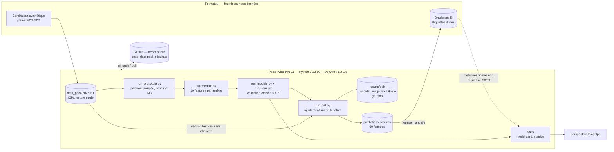
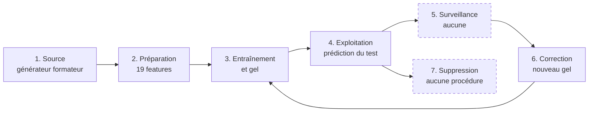
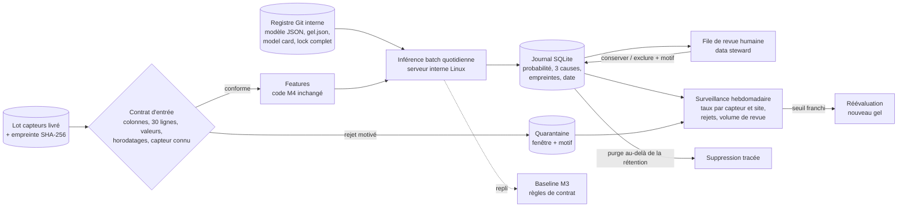

# Évaluation d'une architecture IA — brief online M7

Toutes les valeurs chiffrées de ce dossier portent l'une de ces trois natures :

- **mesuré** : produit par `mesures.py` sur ce poste le 28/09/2026 (exécution de
  référence `2026-09-28T06:10:35Z`), et consigné dans `results/mesures.json` ;
- **estimé** : calculé à partir d'une hypothèse écrite à côté du chiffre ;
- **repris** : mesuré au M4 le 31/08/2026, cité avec son fichier source.

Aucune valeur n'est présentée sans sa nature.

## Synthèse pour décision

| Constat | Preuve | Conséquence |
|---|---|---|
| Le modèle se reconstruit **octet pour octet** à partir du code, du data pack et des versions figées | empreinte du réajustement = `164d05b1…` du gel (mesuré) | réversibilité et reprise assurées tant que code, données et versions sont conservés |
| La performance ne pose aucune contrainte : 1,6 ms par fenêtre de bout en bout, 0,09 ms pour la prédiction seule | p50 mesurés | aucune raison d'introduire une API ou un service ; un batch suffit |
| **Six entrées invalides sur neuf produisent une prédiction sans erreur** — dont une fenêtre sans aucune valeur, déclarée `réelle` | injection de pannes (mesuré) | condition bloquante : un contrôle de contrat d'entrée doit précéder toute exploitation |
| Des fenêtres à valeurs constantes (capteur figé) sont déclarées `fabriquée` à 1,000 | injection (mesuré) | le modèle confond défaut de qualité et fabrication, alors que la model card exclut explicitement ce glissement |
| Le taux de signalement sur le test varie de 0 % (`rpm`) à 57 % (`pressure_bar`) | taux sans étiquette (mesuré) | écart non interprétable sans l'oracle ; à surveiller par segment |
| Le résultat de l'oracle scellé n'a pas été reçu | recherche dans les dépôts M4 à M7 | la décision M4 `évaluer davantage` reste valide ; aucune adoption |
| Le modèle n'utilise que 2 ko de paramètres mais embarque 290 Mo de dépendances d'exécution (1,2 Go de venv) | tailles sur disque (mesuré) | un export JSON (mesuré, décisions identiques 60/60) ramène les dépendances à 118 Mo |

**Décision proposée** : maintenir `évaluer davantage`. Engager dès maintenant les
évolutions qui ne dépendent pas de l'oracle (contrat d'entrée, journal
versionné, packaging réduit), et conditionner tout déploiement au résultat de
l'oracle et à l'avis des acteurs listés en §11.

Livrables associés : `mesures.py` et `results/mesures.json` (mesures),
`restitution.md` (support de 5 diapositives), `journal_decisions.md`
(décisions, raisons, preuves).

---

## 1. Cas et procédure

### 1.1 Cas retenu

| | |
|---|---|
| Système | détecteur de provenance de fenêtres capteurs, candidat M4 gelé le 31/08/2026 |
| Modèle | `StandardScaler` + `LogisticRegression` (`class_weight="balanced"`), 19 features, seuil 0,50, graine 20260831 |
| Finalité | signaler, avant un apprentissage, les fenêtres de 30 mesures dont la provenance paraît fabriquée |
| Utilisateur | équipe data DiagOps — en pratique une seule personne (Nicolas, apprenant) |
| Nature de la décision | aide au tri, jamais suppression automatique (model card M4) |
| Usages exclus (repris de la model card) | prédire une panne, juger la qualité d'une mesure, exclure seul une donnée, `temperature_c`, tout parc hors synthétique DiagOps |
| Statut | `évaluer davantage` (matrice de décision M4) |

### 1.2 Sources lues

| Source | Ce qui en est tiré |
|---|---|
| `diagops-m4/work/M4/README.md`, `requirements.lock`, `configs/model.yaml` | installation, versions épinglées, cible, graine |
| `diagops-m4/work/M4/src/protocole.py`, `src/modele.py` | partition groupée, features, candidats |
| `diagops-m4/work/M4/run_modele.py`, `run_gel.py` | validation croisée, gel, lecture du test |
| `diagops-m4/work/M4/results/gel/gel.json`, `results/modele/modele.json` | empreintes, performance attendue |
| `diagops-m4/work/M4/docs/journal_bord.md`, `model_card.md`, `matrice_decision.md`, `protocole_evaluation.md`, `benchmark_modele.md` | décisions, limites, règle de changement |
| `diagops-m4/data_pack/2026-S1/model_eval/README.md`, `reference_runs/m3_for_m4/decision_m3.md` | statut des données, conditions de transmission |
| `diagops-m6/work/M6/veille_diagops/journal.md` | dernier état réglementaire et points ouverts transmis à M7 |
| Intel ARK, fiche Core i7-13620H, consultée le 28/09/2026 | puissance maximale turbo 115 W, base 45 W |
| Scaleway, page tarifs Virtual Instances, consultée le 28/09/2026 | DEV1-S (2 vCPU, 2 Go) 0,00898 €/h HT, PAR-1 |

### 1.3 Architecture existante



| Composant | Technologie | Emplacement | Propriétaire |
|---|---|---|---|
| Données source | CSV (`sensor_calibration.csv` 900 lignes, `sensor_test.csv` 1 800 lignes) | `diagops-m4/data_pack/2026-S1/model_eval/`, versionné dans le dépôt | formateur |
| Préparation | pandas 2.3.1, numpy 2.3.2 — `src/modele.py` | poste local | Nicolas |
| Entraînement et gel | scikit-learn 1.7.1 — `run_modele.py`, `run_gel.py` | poste local | Nicolas |
| Artefact | pickle joblib, 1 953 octets | `results/gel/`, versionné (ajout forcé malgré `results/*` dans `.gitignore`) | Nicolas |
| Prédictions | CSV, 60 lignes, sans date ni version par ligne | `results/gel/predictions_test.csv` | Nicolas, remis au formateur |
| API | **aucune** — scripts en ligne de commande | — | — |
| Stockage distant | GitHub, dépôt **public** `lebnicolas/diagops` (choix assumé depuis le M0) | hors UE (fournisseur américain) ; données et artefacts lisibles par tous | Nicolas |
| Environnement | Windows 11, portable Acer Nitro, i7-13620H, 31,7 Gio | poste personnel | Nicolas |
| Fournisseurs logiciels | numpy, pandas, scipy, scikit-learn, joblib, threadpoolctl — licences BSD-3 (lues dans les métadonnées du venv) | PyPI | communautés open source |

Constats d'architecture relevés à la lecture, avant mesure :

1. **Pas d'exploitation au sens propre** : le modèle a servi une fois, pour
   prédire les 60 fenêtres du test. Aucune planification, aucun appelant.
2. **Aucun contrôle d'entrée** en dehors de l'absence de colonne `provenance`
   (`run_gel.table_test`) et de `features manquantes` (NaN) après calcul.
3. **Lock incomplet** : `requirements.lock` épingle numpy, pandas et
   scikit-learn, mais ni scipy (1.18.1 installé), ni joblib (1.5.3), ni
   threadpoolctl. Une réinstallation peut changer ces versions ; l'artefact
   pickle y est sensible.
4. **Surveillance inexistante** : la model card prévoit une réévaluation « à
   chaque livraison » sans mécanisme qui la déclenche.

---

## 2. Données et cycle de vie



Les étapes en pointillé n'existent que sur le papier.

| Étape | Contenu | Responsable | Destinataire | Droits | Rétention | Constat |
|---|---|---|---|---|---|---|
| 1. Source | 90 fenêtres synthétiques (30 étiquetées, 60 scellées), 22 et 32 équipements, colonnes `window_id, equipment_id, timestamp, sensor_name, value, unit, period` (+ `provenance` en calibration) | formateur (producteur et propriétaire) | apprenant | lecture seule ; « réservées à la formation » (README du lot) | non définie ; versionnées dans GitHub sans limite | empreintes SHA-256 conformes au gel (mesuré) |
| 2. Préparation | table de 19 features par fenêtre, recalculée en mémoire ; copie en `results/modele/features.csv` | Nicolas | modèle, dossier | écriture locale | aucune règle ; fichier versionné | reconstruisible en 53 ms (calibration) et 97 ms (test) — mesuré |
| 3. Entraînement et gel | ajustement sur 30 fenêtres ; artefact, `gel.json`, empreintes | Nicolas | formateur, M5 | écriture locale, publication Git | conservation de fait illimitée | règle de changement M4 : toute modification impose un nouveau gel |
| 4. Exploitation | 60 prédictions (probabilité, décision) | Nicolas | formateur (oracle) ; en cible, l'équipe data | CSV lisible par toute personne ayant accès au dépôt | aucune | pas de date, pas de version du modèle, pas de champ de revue par ligne |
| 5. Surveillance | — | non attribué | — | — | — | aucun indicateur suivi ; déclencheurs écrits (nouvelle livraison, changement de procédé) sans mécanisme |
| 6. Correction | nouveau gel si features, seuil, modèle, partition, graine ou données changent | Nicolas | formateur | — | l'ancien gel reste consultable dans l'historique Git | procédure écrite et appliquée au M4 |
| 7. Suppression | — | non attribué | — | — | — | aucune procédure ; la seule suppression possible est une réécriture de l'historique Git |

**Données personnelles** : aucune dans les colonnes d'entrée (liste relevée par
`mesures.py`, bloc `biais.colonnes_entree`). `equipment_id` et `timestamp` ne
désignent pas une personne ; ils ne le deviendraient que croisés avec un
planning d'équipe, qui n'existe pas dans le lot.

---

## 3. Procédure d'évaluation

### 3.1 Règles

1. **Périmètre** : le modèle de provenance seul, de la lecture des CSV à la
   décision. Le RAG et l'agent M4 sont hors périmètre.
2. **Le code M4 n'est pas modifié.** `mesures.py` l'importe avec l'écriture de
   bytecode désactivée et compare l'empreinte des 95 fichiers de `work/M4`
   (hors venv et caches) avant et après exécution.
3. **L'oracle n'est pas utilisé.** Le test est relu sans étiquette (il n'en a
   pas), comme le gel du 31/08 l'a autorisé. Aucune métrique de qualité n'est
   calculée sur le test.
4. **Latence** : `time.perf_counter_ns`, échauffement de 3 à 20 appels, puis
   répétitions ; percentiles p50, p95, p99. Nombre de répétitions consigné dans
   le JSON (`n`).
5. **Mémoire** : pic `tracemalloc` pour les allocations Python, RSS `psutil`
   pour le processus.
6. **Nature** : chaque bloc du JSON porte `mesuré`, `estimé` ou `non mesuré`.
7. **Bruit** : poste portable personnel, secteur branché, autres applications
   ouvertes. Les chiffres se lisent en ordre de grandeur. Trois exécutions
   complètes ont été faites ; la variation observée est rapportée.

### 3.2 Axes, protocole et critère

La colonne « critère » s'appuie sur des références extérieures à la mesure
(gel M4, usage déclaré, volume du parc). Chronologie exacte : les axes, les
protocoles et le nombre de répétitions ont été figés dans `mesures.py` avant sa
première exécution ; les critères chiffrés ci-dessous ont été rédigés avec le
dossier, **après** les premières exécutions. C'est une limite, consignée au
journal (D-05).

| Axe | Question | Protocole | Nature | Critère d'acceptation |
|---|---|---|---|---|
| Qualité | la performance attendue du gel se reproduit-elle ? | `run_modele.evaluer` rejoué sur la calibration | mesuré | F1 hors pli égal à 0,694 à 10⁻⁴ près |
| Reproductibilité | l'artefact se reconstruit-il ? | réajustement, `joblib.dump`, SHA-256 comparé au gel ; probabilités comparées à `predictions_test.csv` | mesuré | empreinte identique **ou** écart de probabilité < 10⁻⁶ et 60/60 décisions identiques |
| Latence | une fenêtre est-elle traitée assez vite pour un tri quotidien ? | prédiction unitaire (3 000 appels), lot de 60 (1 000 appels), bout en bout features + prédiction (1 200 appels) | mesuré | traitement du parc entier en moins de 60 s par jour |
| Capacité | le volume du parc tient-il ? | 420 équipements × capteurs observés / durée d'une fenêtre | estimé | idem |
| Disponibilité | combien de temps pour reprendre après arrêt ? | démarrage à froid dans un processus neuf, 10 essais | mesuré | reprise en moins de 1 min (le traitement est différable) |
| Ressources | mémoire, disque | `tracemalloc`, RSS, taille des fichiers et du venv | mesuré | tient sur une VM de 2 Go |
| Coût | coût marginal et coût d'un hébergement dédié | tarif public daté | estimé / non mesuré | — (information pour décision) |
| Énergie | ordre de grandeur par fenêtre | temps CPU × puissance maximale du processeur | estimé | — (information pour décision) |
| Maintenabilité | dépendances, verrouillage, lisibilité | lecture du lock, tailles des paquets | mesuré | dépendances d'exécution toutes épinglées |
| Modes de panne | que se passe-t-il sur une entrée invalide ? | 9 altérations d'une fenêtre du test + artefact tronqué | mesuré | toute entrée invalide est **rejetée**, jamais prédite |
| Biais | le traitement diffère-t-il selon le capteur, le site, la criticité ? | taux de signalement sur le test (sans étiquette), erreurs hors pli par capteur (calibration) | mesuré | écarts rapportés ; pas de seuil fixé sans oracle |
| Explicabilité | peut-on dire pourquoi une fenêtre est signalée ? | contribution coefficient × valeur standardisée | mesuré | 3 premières causes disponibles pour chaque fenêtre signalée |

---

## 4. Résultats mesurés

Exécution de référence : `2026-09-28T06:10:35Z`, 28 s. Python 3.12.10,
numpy 2.3.2, pandas 2.3.1, scikit-learn 1.7.1, joblib 1.5.3, psutil 7.2.2.

### 4.1 Qualité et reproductibilité

| Mesure | Valeur | Nature |
|---|---:|---|
| F1 hors pli (calibration, 5 partitions) | **0,694 ± 0,068** (min 0,600, max 0,800) | mesuré — identique au gel |
| ROC-AUC hors pli | 0,737 | mesuré |
| Matrice première répétition | 7 VP, 3 FP, 4 FN, 16 VN | mesuré |
| Baseline M3 | 0,375 | repris (`gel.json`) |
| Empreinte du réajustement | `164d05b129ce5e41…`, **identique au gel** | mesuré |
| Écart de probabilité artefact gelé / prédictions remises | 0,0 | mesuré |
| Décisions identiques aux prédictions remises | 60 / 60 | mesuré |
| F1 sur le test | **inconnu** — oracle non reçu | — |

### 4.2 Latence, entraînement, démarrage

| Opération | p50 | p95 | p99 | n | Nature |
|---|---:|---:|---:|---:|---|
| Prédiction, 1 fenêtre (`predict_proba`) | 0,093 ms | 0,114 ms | 0,181 ms | 3 000 | mesuré |
| Prédiction, lot de 60 fenêtres | 0,099 ms | 0,146 ms | 0,258 ms | 1 000 | mesuré |
| — soit par fenêtre dans le lot | 0,0017 ms | | | | mesuré |
| **Bout en bout, 1 fenêtre** (19 features + prédiction) | **1,61 ms** | **2,09 ms** | 2,72 ms | 1 200 | mesuré |
| Préparation calibration (lecture + features, 30 fenêtres) | 53,3 ms | 64,4 ms | | 30 | mesuré |
| Préparation test (60 fenêtres) | 97,1 ms | 118,3 ms | | 30 | mesuré |
| Ajustement sur 30 fenêtres | 1,90 ms | 2,18 ms | 2,67 ms | 200 | mesuré |
| Validation croisée 5 × 5 complète | 0,084 s | | | 1 | mesuré |
| Chargement de l'artefact joblib | 0,236 ms | 0,336 ms | | 100 | mesuré |
| Import numpy + pandas + scikit-learn + joblib | 899 ms | | | 1 | mesuré |
| **Démarrage à froid** (processus neuf → 1re prédiction) | **1,20 s** | 1,23 s | | 10 | mesuré |

Lecture : la prédiction est un produit scalaire de 19 termes. **Le calcul des
features pèse environ 94 % de la latence de bout en bout** ((1,61 − 0,09) / 1,61), et l'import des
bibliothèques pèse l'essentiel du démarrage.

Variation entre les trois exécutions complètes : p95 de bout en bout à 1,81,
1,95 puis 2,09 ms. L'écart de 15 % reflète le bruit du poste, pas le modèle.

### 4.3 Ressources

| Mesure | Valeur | Nature |
|---|---:|---|
| Pic mémoire à l'ajustement (`tracemalloc`) | 56,1 ko | mesuré (56 ko au M4) |
| Pic mémoire, prédiction d'un lot de 60 | 20,0 ko | mesuré |
| RSS du processus : départ → après imports | 35 → 150 Mo | mesuré |
| Artefact joblib | 1 953 octets | mesuré |
| Code utile au modèle (`src/modele.py`, `src/protocole.py`, `run_gel.py`) | 28 767 octets | mesuré |
| venv M4 complet | 1 209 Mo | mesuré |
| — dont torch (sert le RAG, pas ce modèle) | 492 Mo | mesuré |
| Dépendances d'exécution du modèle (scikit-learn, scipy, joblib, threadpoolctl, numpy, pandas et dépendances) | **290 Mo** | mesuré |

### 4.4 Capacité, énergie, coût

| Mesure | Valeur | Nature et hypothèse |
|---|---:|---|
| Fenêtres à traiter par jour, parc entier | 109 | **estimé** : 420 équipements (`equipment.csv`) × 1,95 capteur par équipement (`sensor_readings.csv`) / 7,5 jours par fenêtre (30 mesures au pas de 6 h) |
| Temps de calcul quotidien, au p95 de bout en bout | 0,23 s | estimé à partir du p95 mesuré |
| Débit de prédiction en lot | ~600 000 fenêtres/s | mesuré (p50), hors préparation |
| Énergie par fenêtre, bout en bout | ≤ 0,19 J | **estimé, borne haute** : temps CPU mesuré (1,68 ms) × 115 W (puissance maximale turbo du processeur entier, Intel ARK, consulté le 28/09/2026) |
| Énergie quotidienne du parc | ≤ 0,006 Wh | estimé, même méthode |
| Énergie d'un démarrage à froid | ≤ 0,038 Wh | estimé : 1,2 s × 115 W. **Le démarrage coûte six fois plus que le traitement quotidien** |
| Consommation réelle, empreinte carbone | non mesuré | ni wattmètre, ni compteur RAPL lisible sous Windows |
| Coût marginal sur le poste actuel | 0 € facturé | le coût du poste, de l'électricité et du temps de revue humaine n'est pas chiffré |
| Coût d'une VM dédiée | ~6,55 €/mois HT | estimé : Scaleway DEV1-S, 0,00898 €/h HT, PAR-1, page consultée le 28/09/2026 ; hors stockage, sauvegarde et temps d'administration |

Limite de mesure : sous Windows, `time.process_time` avance par pas de
15,6 ms. Le temps CPU de la prédiction seule (1,56 µs par fenêtre, sur 60 000
fenêtres) est donc arrondi à ±17 % ; celui du bout en bout (2 s cumulées) l'est
à moins de 1 %.

---

## 5. Grille

| Axe | Constat | Mesure ou estimation | Source/protocole | Alternative | Risque/condition |
|---|---|---|---|---|---|
| **qualité** | gain sur la baseline reproduit ; performance réelle inconnue | F1 hors pli 0,694 ± 0,068 contre 0,375 — **mesuré** | `run_modele.evaluer` rejoué, §4.1 | aucune avant l'oracle | décision bloquée tant que l'oracle n'a pas parlé ; `temperature_c` hors couverture |
| **capacité** | volume du parc négligeable pour le calcul | 109 fenêtres/jour, 0,23 s de calcul — **estimé** | hypothèses §4.4 | — | hypothèse fausse si le pas d'échantillonnage passe sous la minute |
| **latence** | 1,6 ms de bout en bout, dominée par les features | p50 1,61 ms, p95 2,09 ms — **mesuré** | §4.2, 1 200 appels | Python pur pour le modèle : 0,0013 ms (mesuré), gain sans effet sur le bout en bout | aucune contrainte à ce volume |
| **disponibilité** | pas de service ; reprise = relancer un script | démarrage à froid 1,20 s — **mesuré** ; disponibilité du poste : **non mesurée** | §4.2, 10 processus neufs | batch planifié sur serveur interne | poste personnel éteint ou perdu : traitement suspendu, sans perte (artefact reconstruisible) |
| **reproductibilité** | réajustement identique octet pour octet | SHA-256 identique — **mesuré** | §4.1 | — | vrai pour les versions installées ; lock incomplet (scipy, joblib, threadpoolctl non épinglés) |
| **stockage** | CSV + pickle, versionnés dans GitHub ; prédictions sans date ni version | CSV de 3 365 o pour 60 lignes — **mesuré** | lecture des fichiers | journal SQLite versionné avec purge — **mesuré** : 720 lignes insérées en 13 ms, purge à 180 j en 1,9 ms | rétention à arrêter avec le juridique ; hébergement GitHub hors UE |
| **packaging** | 2 ko de paramètres, 290 Mo de dépendances, format pickle | tailles — **mesuré** | §4.3 | export JSON sans scikit-learn : 1 902 o, décisions 60/60, écart ≤ 2,2 × 10⁻¹⁶, dépendances 118 Mo — **mesuré** | pickle exécute du code au chargement ; export JSON à re-générer à chaque gel |
| **coût** | nul en marginal | 0 € facturé ; VM dédiée ~6,55 €/mois HT — **estimé** | tarif Scaleway daté | serveur interne existant | coût humain de la revue non chiffré, et c'est le poste principal |
| **empreinte** | négligeable en calcul, dominée par le démarrage | ≤ 0,006 Wh/jour, ≤ 0,038 Wh par démarrage — **estimé** | §4.4 | un seul démarrage par lot quotidien | aucune mesure réelle ; ordre de grandeur seulement |
| **compétences** | Python, pandas, scikit-learn ; une seule personne connaît le système | — | lecture du dépôt | documentation existante (model card, protocole) | bus factor de 1 |
| **biais** | taux de signalement très inégal par capteur et par site | test : `rpm` 0/6, `pressure_bar` 8/14 ; SITE-EST 1/8, SITE-SUD 8/20 — **mesuré** | §7.1 | surveillance par segment | écart non attribuable sans oracle ; `temperature_c` hors couverture |
| **confidentialité** | aucune donnée personnelle en entrée | 7 colonnes relevées — **mesuré** | §2 | — | change si le modèle reçoit des données réelles liées à des équipes |
| **supervision** | principe écrit (revue humaine), aucun support | CSV sans champ de revue — **mesuré** | lecture de `predictions_test.csv` | champ `revue_humaine` dans le journal | sans file de revue, le principe n'est pas exécutable |
| **modes de panne** | 6 entrées invalides sur 9 prédites sans erreur | §6 — **mesuré** | injection | contrat d'entrée bloquant | condition bloquante avant exploitation |

---

## 6. Analyse de scénarios et modes dégradés

### 6.1 Pannes injectées (mesuré)

Fenêtre de référence : `M4-TEST-001`, prédite `réelle` (0,079). Chaque
altération porte sur une copie en mémoire.

| Cas | Résultat | Décision | Détecté ? | Lecture |
|---|---|---|---|---|
| référence non altérée | prédiction 0,079 | réelle | — | — |
| **toutes les valeurs manquantes** | prédiction 0,024 | **réelle** | **non** | la feature `part_manquantes` a un coefficient **nul** (constante en calibration) : le modèle ne voit pas l'absence de données et déclare réelle une fenêtre vide |
| **une seule ligne** au lieu de 30 | prédiction 0,046 | réelle | **non** | aucune vérification de la taille de fenêtre |
| **capteur inconnu** (`humidite_pct`) | prédiction 0,079, identique à la référence | réelle | **non** | le capteur n'entre que dans la plage physique, qui devient infinie |
| **valeurs constantes** (capteur figé) | prédiction **1,000** | **fabriquée** | **non** | `plus_longue_repetition` porte le plus fort coefficient (1,107) : un défaut de qualité est lu comme une fabrication — l'usage que la model card exclut |
| **horodatages illisibles** | prédiction 0,035 | réelle | **non** (1 alerte pandas de format, pas d'erreur) | la grille temporelle est vue comme conforme |
| **valeur à 10¹²** | prédiction 0,046 | réelle | **non** | une valeur absurde ne déclenche rien |
| colonne `unit` absente | `KeyError` | — | oui | échec franc |
| fenêtre vide | `IndexError` | — | oui | échec franc, message peu lisible |
| artefact joblib tronqué | `ValueError` au chargement | — | oui | échec franc |

**Conclusion** : les échecs francs sont sains, les six prédictions silencieuses
ne le sont pas. Le système ne distingue pas « fenêtre réelle » et « fenêtre
inexploitable ». C'est la principale contrainte trouvée par cette évaluation, et
aucune mesure de qualité sur le lot de calibration ne pouvait la révéler : le lot
ne contient aucune de ces entrées.

### 6.2 Scénarios qualifiés

| Scénario | Effet | Détection actuelle | Reprise | Nature |
|---|---|---|---|---|
| Poste perdu ou hors service | traitement suspendu | immédiate (rien ne tourne) | code, données et artefact dans GitHub ; réajustement identique en 2 ms (mesuré) ; réinstallation du venv **non testée** | qualifié, partiellement mesuré |
| Mise à jour de scikit-learn | chargement du pickle refusé ou avec avertissement de version | aucune | réajuster sous la nouvelle version = **nouveau gel** (règle M4) ; ou export JSON, insensible à la version | **non testé** (pas d'autre version installée, pas de réseau) |
| Artefact corrompu | exception au chargement | oui (mesuré) | réajustement depuis les sources, empreinte vérifiable | mesuré |
| Entrée malformée | prédiction silencieuse dans 6 cas sur 9 | non | aucune | mesuré |
| Oracle défavorable (F1 test ≤ 0,375) | décision `écarter` (condition écrite au M4) | à réception | repli sur la baseline M3, figée et conservée | qualifié sur table |
| Nouveau générateur (dérive) | rappel en baisse, invisible sans étiquettes | non | réévaluation obligatoire à chaque livraison (model card) — sans mécanisme | qualifié sur table |
| Mode dégradé | — | — | baseline M3 (règles de contrat, zéro dépendance) : F1 0,375 par fenêtre | repris |

**Objectifs de reprise proposés** (estimation, à valider avec l'infra) : RTO de
1 jour ouvré (traitement différable, pas de décision en temps réel) ; RPO nul
pour le modèle (reconstruisible) ; RPO à définir pour le journal des revues
humaines, qui sera la seule donnée non reconstruisible de la cible.

---

## 7. Impacts

### 7.1 Biais et discrimination

Le système ne décide rien sur des personnes : pas de discrimination au sens
juridique. Le biais porte sur **quelles données** sont écartées, et donc sur ce
qu'un modèle aval apprendra.

Taux de signalement sur les 60 fenêtres du test (mesuré, sans étiquette) :

| Segment | Fenêtres | Signalées | Taux |
|---|---:|---:|---:|
| `pressure_bar` | 14 | 8 | **57 %** |
| `vibration_mm_s` | 13 | 4 | 31 % |
| `current_a` | 14 | 3 | 21 % |
| `temperature_c` | 13 | 2 | 15 % |
| `rpm` | 6 | 0 | **0 %** |
| SITE-SUD | 20 | 8 | 40 % |
| SITE-NORD | 32 | 8 | 25 % |
| SITE-EST | 8 | 1 | 12,5 % |
| criticité `critical` | 26 | 5 | 19 % |
| criticité `high` | 22 | 7 | 32 % |

Taux global : 28,3 % (17/60), contre 36,7 % de fabriquées en calibration.

Ce que ces chiffres permettent de dire : **le traitement est inégal**. Ce qu'ils
ne permettent pas : dire si l'inégalité est une erreur. Le vrai taux de
fabriquées par segment dans le test est inconnu. Deux points attirent
l'attention :

- `pressure_bar` : 3 fenêtres seulement en calibration, 14 dans le test, et le
  segment le plus signalé. Hypothèse à vérifier avec l'oracle : des fenêtres
  réelles à défaut de qualité (hors plage, sentinelles — `part_hors_plage` a un
  coefficient positif de 0,39) seraient lues comme fabriquées ;
- en calibration, les faux positifs se concentrent sur `vibration_mm_s` (2 sur
  5 réelles) et `current_a` (1 sur 2 réelles) ; `temperature_c` rate sa seule
  fabriquée.

Conséquence aval si le modèle était adopté : un site ou un capteur
sur-signalé perdrait une part plus grande de ses mesures authentiques, et le
modèle de diagnostic suivant serait appris sur un parc déformé.

### 7.2 Données personnelles

Aucune dans les 7 colonnes d'entrée (mesuré). Le RGPD ne s'applique pas au
périmètre actuel. Il s'appliquerait si le journal cible enregistrait **qui**
a validé ou écarté une fenêtre (champ `revue_humaine`) : ce serait alors une
donnée personnelle de salarié, avec finalité, durée et information à définir.
Le relais M6 le rappelle : la boucle de feedback M6 a fait entrer des données
personnelles par un champ libre.

### 7.3 Explicabilité

La régression logistique est explicable par construction. Pour chacune des 17
fenêtres signalées du test, les 3 premières contributions (coefficient × valeur
standardisée) ont été calculées (mesuré) :

| Feature | Présences dans le top 3 |
|---|---:|
| `part_changements_de_signe` | 13 / 17 |
| `autocorr_lag2` | 10 / 17 |
| `plus_longue_repetition` | 7 / 17 |
| `autocorr_lag4` | 7 / 17 |
| `part_valeurs_distinctes` | 5 / 17 |
| `part_hors_plage` | 4 / 17 |

La structure temporelle explique la majorité des signalements, ce qui est
cohérent avec le M4. Mais cette explication n'est **exposée nulle part** : le
CSV remis ne contient que la probabilité. Un relecteur ne sait pas pourquoi une
fenêtre est signalée. Trois coefficients sont nuls (`part_manquantes`,
`part_precision_excessive`, `unite_conforme`) : ces contrôles, constants en
calibration, n'ont aucun effet sur la décision — ce qui explique la panne
« toutes valeurs manquantes ».

### 7.4 Destinataires indirects

| Destinataire | Effet |
|---|---|
| data scientists en aval | apprennent sur un jeu filtré par le modèle |
| techniciens de maintenance des sites sur-signalés | leurs mesures sont plus souvent mises en doute |
| responsables de sites | un taux de signalement peut être lu, à tort, comme un indicateur de fiabilité du site |
| formateur (producteur des données) | reçoit les prédictions, calcule le verdict |
| auditeurs | doivent pouvoir retrouver quelle version a produit quelle décision — impossible aujourd'hui |

### 7.5 Supervision humaine

Le principe est écrit (model card : « toute exclusion reste une décision
humaine ») mais **aucun support ne le rend exécutable** : ni file de revue, ni
champ de décision, ni trace de qui a tranché. Avec un rappel de 0,636, 4
fabriquées sur 11 passent ; avec une précision de 0,700, 3 signalements sur 10
visent une mesure authentique. La revue humaine n'est donc pas une formalité :
elle porte sur environ 30 % des signalements.

Risque d'automatisation : 109 fenêtres par jour dont ~30 signalées (estimation
au taux du test) ; un relecteur unique finira par valider en bloc. Le seuil de
charge acceptable est à fixer avec le métier.

### 7.6 Conformité

| Texte | Position | Nature | À valider par |
|---|---|---|---|
| AI Act — classification | système d'aide au tri de données internes, hors annexe III, pas composant de sécurité d'une machine : pas haut risque en l'état | analyse, texte consolidé **non lu** (relais M6 n° 1, reporté depuis M5) | juridique |
| AI Act — article 50 | non déclenché : aucun contenu généré, aucune interaction avec une personne | repris du journal de veille M6 | juridique |
| AI Act — article 4 (maîtrise de l'IA) | les personnes qui relisent les signalements doivent connaître les limites du modèle (rappel, segments non couverts) | analyse | juridique, RH |
| RGPD | non applicable au périmètre actuel ; applicable au journal de revue s'il nomme les relecteurs | analyse | DPO |
| Licence des données | « réservées à la formation » : aucune exploitation hors formation | README du lot | formateur |
| Licences logicielles | BSD-3 pour toutes les dépendances d'exécution | métadonnées du venv (mesuré) | — |

---

## 8. Matrice d'alternatives

| Axe | Existant | Alternative | Bénéfice | Coût | Risque | Prérequis | Critère de succès | Preuve |
|---|---|---|---|---|---|---|---|---|
| **Stockage** — prédictions | CSV sans date ni version | **S1 — journal SQLite** : empreinte modèle, empreinte entrée, date, champ de revue, purge par date | traçabilité par ligne, rétention applicable, revue humaine enregistrable | 110 ko pour 420 lignes (mesuré) ; stdlib Python, pas de serveur | fichier unique, pas d'accès concurrent ; donnée personnelle si le relecteur est nommé | durée de rétention validée (180 j proposés) | 100 % des lignes avec empreinte ; purge vérifiée par test | **exécuté** : 720 lignes en 13 ms, purge en 1,9 ms, 420 restantes |
| **Stockage** — artefacts | GitHub public, ajout forcé malgré `.gitignore` | **S2 — dépôt Git interne** (Gitea/GitLab auto-hébergé) ou stockage objet S3 compatible sur site | données et artefacts restent sous contrôle, hors fournisseur américain | serveur et administration : non chiffré | migration de l'historique ; perte de l'intégration GitHub | serveur interne disponible | dépôt cloné et vérifié par empreintes, GitHub retiré | non exécuté |
| **Packaging** — format du modèle | pickle joblib, scikit-learn 1.7.1 exigé au chargement | **P1 — paramètres en JSON** + inférence numpy (ou Python pur) | plus d'exécution de code au chargement ; indépendant de la version de scikit-learn ; dépendances 290 → 118 Mo | re-générer le JSON à chaque gel ; tests d'équivalence | divergence si le pipeline change (autre modèle que linéaire) | test d'équivalence dans le script de gel | écart de probabilité < 10⁻⁹ et décisions identiques sur tout lot | **exécuté** : écart 0 (numpy), 2,2 × 10⁻¹⁶ (Python pur), 60/60 décisions |
| **Packaging** — environnement | venv M4 partagé avec le RAG, 1,2 Go, lock partiel | **P2 — lock dédié complet** (toutes dépendances transitives épinglées, avec empreintes) | réinstallation reproductible, surface réduite | 1 h de travail (estimé) | aucune nouvelle | accès PyPI ou miroir interne | réinstallation à neuf puis empreinte de réajustement identique | non exécuté (pas de réseau) |
| **Packaging** — livraison | scripts dans le dépôt | **P3 — image conteneur** (Python slim + dépendances P1/P2) | même exécutable partout | image de l'ordre de la centaine de Mo : **non mesuré** ; registre à maintenir | dérive de l'image de base | runtime conteneur sur la cible | image reconstruite avec la même empreinte de sortie | non exécuté |
| **Environnement** | poste personnel Windows, lancement manuel | **E1 — batch planifié sur serveur interne Linux** (cron ou timer systemd) | indépendance vis-à-vis du poste ; exécution régulière ; données sur site | ressources négligeables (150 Mo de RSS, 0,2 s/jour) ; coût d'administration non chiffré | un serveur de plus à maintenir | serveur existant, compte de service, accès aux lots | 30 jours d'exécutions sans échec non signalé | non exécuté |
| **Environnement** | idem | **E2 — VM cloud UE** (ex. Scaleway DEV1-S, 2 vCPU, 2 Go) | pas de matériel à gérer | ~6,55 €/mois HT (estimé, tarif du 28/09/2026) + stockage | données industrielles réelles hors site ; réversibilité contractuelle | analyse juridique, chiffrement, contrat | idem E1 + clause de sortie testée | non exécuté |
| **Environnement** | idem | **E3 — API temps réel** | appel à la demande | service permanent, authentification, supervision | complexité sans besoin : 109 fenêtres/jour | un appelant réel qui en a besoin | — | **écartée** : aucun besoin mesuré |

Choix retenus pour la cible : **S1, P1, P2, E1**. S2 et P3 restent en réserve,
E2 est écartée tant que les données réelles ne sont pas qualifiées, E3 est
écartée faute de besoin.

---

## 9. Architecture cible

Valable **uniquement** si l'oracle confirme le gain (§10, étape 0). Sinon, la
cible est la baseline M3 dans le même cadre (contrat d'entrée, journal, revue).



Frontières de confiance :

1. **Entrée** : tout lot est non fiable jusqu'au contrat d'entrée. Une fenêtre
   rejetée n'est jamais prédite.
2. **Modèle** : chargé depuis un JSON dont l'empreinte est comparée à celle du
   registre ; plus de pickle en exploitation.
3. **Décision** : le système signale ; seule la file de revue écrit
   « exclure ».

---

## 10. Plan d'évolution priorisé

| Prio | Évolution | Répond au constat | Responsable proposé | Effort | Critère de succès |
|---|---|---|---|---|---|
| **0** | Obtenir le verdict de l'oracle | décision bloquée (§4.1) | formateur | — | F1 test reçu, daté, comparé à 0,694 ± 0,068 ; décision `adopter` ou `écarter` écrite |
| **1** | Contrat d'entrée bloquant (30 lignes, valeurs numériques présentes, horodatages lisibles au pas nominal, capteur dans la liste, colonnes présentes) | 6 pannes silencieuses sur 9 (§6.1) | équipe data | 0,5 j (estimé) | les 9 cas de `mesures.py` rejetés avec motif ; 0 rejet sur les 90 fenêtres du lot |
| **1** | Séparer « inexploitable » de « fabriquée » : une fenêtre constante part en quarantaine qualité, pas en signalement de provenance | capteur figé lu comme fabrication (§6.1) | équipe data + métier | 0,5 j (estimé) | cas `valeurs_constantes` rejeté par le contrat, pas prédit |
| **2** | Lock complet et dédié au modèle (P2) | scipy, joblib, threadpoolctl non épinglés | équipe data | 1 h (estimé) | réinstallation à neuf, empreinte de réajustement identique |
| **2** | Export JSON au gel (P1), test d'équivalence dans le script de gel | pickle, 290 Mo de dépendances | équipe data | 0,5 j (estimé) | 60/60 décisions identiques, écart < 10⁻⁹ |
| **2** | Journal SQLite avec 3 causes par signalement (S1) | CSV sans version ni revue ; explication non exposée | équipe data | 1 j (estimé) | chaque ligne porte empreintes, date, causes ; purge testée |
| **3** | File de revue humaine et charge maximale par relecteur | supervision non exécutable (§7.5) | métier | à cadrer | 100 % des exclusions avec auteur et motif |
| **3** | Surveillance hebdomadaire par segment, alerte si un taux sort de la plage observée | biais de traitement (§7.1), dérive invisible | équipe data | 1 j (estimé) | rapport produit 4 semaines de suite ; seuils validés par le métier |
| **4** | Batch planifié sur serveur interne (E1), dépôt Git interne (S2) | dépendance au poste personnel ; hébergement hors UE | infra | à chiffrer | 30 jours d'exécutions tracées |
| **4** | Couvrir `temperature_c` (nouvelles fenêtres fabriquées) | segment hors preuve | formateur / producteur | — | au moins 5 fabriquées `temperature_c` évaluées |

Les efforts sont des **estimations** de l'auteur, non vérifiées.

---

## 11. Acteurs à consulter

| Acteur | Question | Décision qui en dépend |
|---|---|---|
| **Métier** — responsable fiabilité / maintenance | un rappel de 0,636 suffit-il ? quel coût relatif d'un faux négatif et d'un faux positif ? quelle charge de revue par jour est tenable ? | seuil de décision, adoption, taille de la file de revue |
| **Métier** — data steward | qui tranche une exclusion, avec quel motif ? une fenêtre constante est-elle un défaut qualité ou un soupçon de fabrication ? | contrat d'entrée, circuit de revue |
| **Sécurité** — RSSI | le chargement de pickle est-il admis en exploitation ? qui peut déposer un lot ou un modèle ? | P1, droits sur le registre et sur le journal |
| **Juridique** — DPO | le nom du relecteur dans le journal : finalité, durée, information ? | champ `revue_humaine`, rétention |
| **Juridique** — conformité IA | lecture du texte consolidé de l'AI Act (point reporté depuis M5) ; confirmation hors haut risque | toute décision opposable |
| **Infrastructure** | un serveur interne peut-il héberger un batch quotidien ? quelle politique de sauvegarde pour le journal ? RTO/RPO proposés acceptables ? | E1, S2, objectifs de reprise |
| **Formateur** (fournisseur des données) | date de restitution de l'oracle ; usage des données hors formation ; procédé du prochain lot | étape 0, licence, réévaluation |

---

## 12. Souveraineté et réversibilité

| Élément | Situation | Réversible ? | Preuve |
|---|---|---|---|
| Modèle | 19 moyennes, 19 échelles, 19 coefficients, 1 intercept | oui : exportable en JSON lisible, reconstruisible octet pour octet | mesuré |
| Code | Python, dépendances BSD-3 | oui : aucune API propriétaire, aucune clé | métadonnées lues |
| Données | CSV | oui | — |
| Hébergement du dépôt | GitHub (fournisseur américain) | oui, par clonage ; non testé | — |
| Calcul | local, aucun appel réseau à l'exécution | oui | lecture du code |
| Repli | baseline M3, figée | oui | repris du M4 |

Aucune dépendance ne rend le retour arrière coûteux. Le seul point de contrôle
externe est l'hébergement Git ; il ne porte que des données synthétiques
aujourd'hui, et deviendrait un sujet dès l'arrivée de données réelles.

---

## 13. Points de désaccord à débattre en restitution

Positions contradictoires, formulées pour la revue simulée :

1. **Exporter en JSON ou garder scikit-learn ?** Pour : sécurité, dépendances,
   indépendance de version. Contre : on perd l'outillage (`get_params`,
   pipelines), et tout changement de modèle impose de réécrire l'inférence.
   Position du dossier : JSON en exploitation, scikit-learn pour l'entraînement.
2. **Corriger les pannes silencieuses dans le modèle ou devant lui ?** Ajouter
   `part_manquantes` au signal exigerait des fenêtres incomplètes en calibration
   — il n'y en a pas. Position : contrat d'entrée devant le modèle, sans nouveau
   gel.
3. **Faut-il attendre l'oracle pour tout ?** Position : non pour le contrat
   d'entrée, le lock et le journal, qui valent aussi pour la baseline ; oui pour
   l'adoption.
4. **Le taux de signalement par site est-il un indicateur ?** Risque de le lire
   comme une note de fiabilité du site. Position : suivi interne à l'équipe
   data, jamais diffusé comme indicateur de site.

---

## 14. Limites

- Mesures sur un poste portable personnel, non isolé ; ordre de grandeur
  seulement. Aucune mesure sur la machine cible.
- Qualité mesurée sur 30 fenêtres de calibration, dont 11 positives ; le
  verdict du test manque.
- Énergie estimée par une borne haute (puissance maximale du processeur
  entier) ; aucune mesure physique. Empreinte carbone non mesurée.
- Coût d'hébergement tiré d'une page tarifaire lue par extraction automatique
  le 28/09/2026 ; à revérifier avant usage.
- Non testés : changement de version de scikit-learn, réinstallation à neuf du
  venv, image conteneur, dépôt Git interne.
- Les critères d'acceptation ont été chiffrés après les premières exécutions
  (§3.2, D-05).
- L'analyse AI Act ne repose pas sur le texte consolidé.

---

## 15. Reproduction

Depuis `diagops-m7/work/M7/online/`, sous Git Bash ou PowerShell :

```bash
# le venv M4 existe déjà ; aucune installation n'est nécessaire
../../../../diagops-m4/work/M4/.venv/Scripts/python.exe mesures.py
# essai rapide du script (répétitions ÷ 10), sortie hors du dossier de résultats
../../../../diagops-m4/work/M4/.venv/Scripts/python.exe mesures.py --rapide --output /tmp/mesures_rapide.json
```

Sous PowerShell, remplacer `/` par `\`. Sortie : `results/mesures.json`
(~28 s). Le script vérifie lui-même :

- que les empreintes des CSV sont celles du gel et de la copie du data pack M7 ;
- que le F1 hors pli reproduit 0,694 ;
- que le réajustement a l'empreinte du gel ;
- que les 95 fichiers de `diagops-m4/work/M4` (hors venv et caches) sont
  inchangés après exécution (`non_modification_m4.identique_avant_apres`).

Si le venv M4 n'existe pas : créer `online/.venv` avec Python 3.12, puis
installer numpy 2.3.2, pandas 2.3.1, scikit-learn 1.7.1 et psutil (optionnel),
et lancer `mesures.py --m4 <chemin de work/M4>`. Ce chemin n'a pas été exercé.
